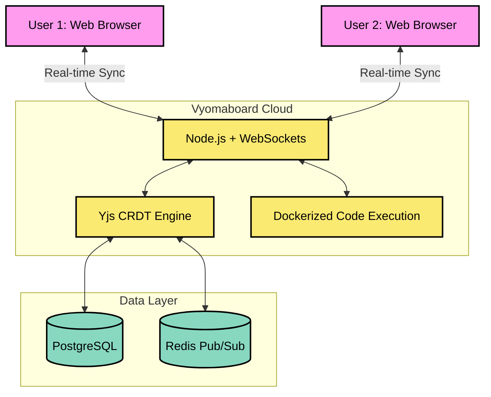
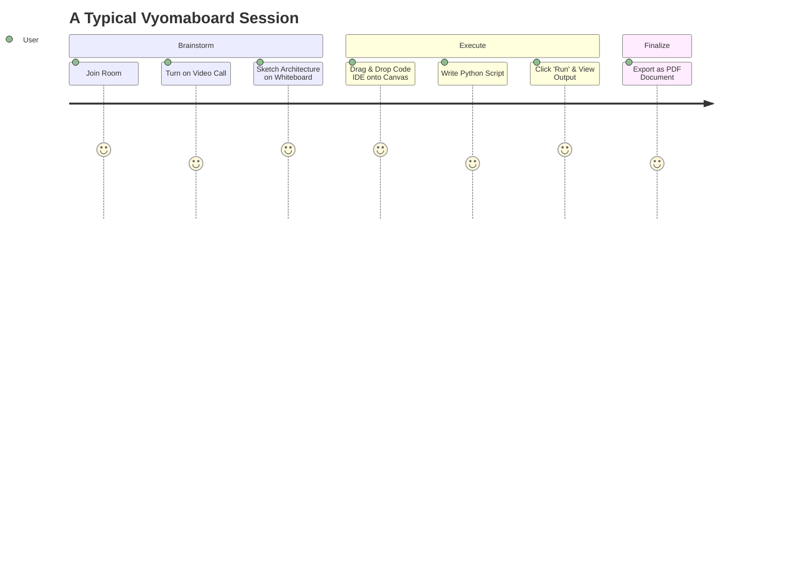

# 🚀 Vyomaboard: The Infinite Collaborative Workspace

> [!TIP]
> **One unified canvas to whiteboard, document, code, and video chat.**

---

## 🛑 Problem vs 💡 Proposed Solution

| **The Problem (Tool Sprawl)** | **The Vyomaboard Solution** |
| :--- | :--- |
| **Context Switching:** Teams waste 20% of their time jumping between Miro, Google Docs, Zoom, and VS Code. | **Unified Canvas:** Everything happens in one infinite, real-time multiplayer workspace. |
| **High Costs:** Paying for multiple enterprise subscriptions drains startup and education budgets. | **All-in-One Efficiency:** Replaces 4+ tools, drastically reducing overhead costs. |
| **Passive Learning:** Remote education suffers from disconnects between theory and practice. | **Interactive Learning:** Teachers can draw diagrams while students execute live code next to it. |

---

## 🎯 Unique Value Proposition (UVP)

- **World’s First Integrated IDE & Canvas:** Write, compile, and run real code (Python, JS, C++) directly on a sticky note.
- **Built-in Seamless Communication:** Video calls and group chat natively embedded in the canvas.
- **Enterprise Privacy:** Fully self-hostable ensuring schools and companies control their IP.

---

## 🏗️ Architecture & Technical Approach

---

## ⚙️ Feasibility & Viability

- **Technical:** Built on proven open-source CRDTs (Yjs) and rendering engines (tldraw).
- **Scalable:** Redis Pub/Sub architecture handles hundreds of concurrent active rooms.
- **Market Viability:** Targets the rapidly growing $3.8B remote collaboration and EdTech market.

### 🛡️ Risk & Mitigation
> [!WARNING]
> **Risk:** Heavy code execution slowing down the collaborative whiteboard.
> **Mitigation:** Code execution is offloaded to isolated, sandboxed server containers (Docker), keeping the frontend lightweight and secure.

---

## 🌍 Impacts & Benefits

### 1. Social & Educational
Bridging the digital divide. Students in developing regions only need a basic browser to access world-class IDEs and collaborative tools.

### 2. Economic 
Consolidating fragmented tools saves remote teams and startups significant subscription and software costs.

### 3. Environmental (Green IT)
Moving heavy local computing (running full desktop IDEs and office suites) to optimized shared cloud architectures cuts hardware energy usage.

---

## 🔄 How Vyomaboard Works (The Workflow)

